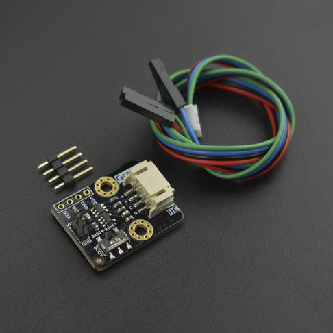

# DFRobot_MCP4725 

* [中文版](./README_CN.md)
  
MCP4725 is a 12-bit I2C-driven high precision DAC module. It has an EEPROM inside, 
means that the DAC will retain the current voltage output after power-down or reset.



## Product Link (https://www.dfrobot.com.cn/goods-1728.html)
    SKU: DFR0552

## Table of Contents
  - [Summary](#summary)
  - [Installation](#installation)
  - [Methods](#methods)
  - [Compatibility](#compatibility)
  - [History](#history)
  - [Credits](#credits)

## Summary
Provides an Arduino library for reading and interpreting Bosch MCP4725 data over I2C.

## Installation

To use this library, please download the library file first and paste it into the \Arduino\libraries directory, then open the examples folder and run the demo in the folder.

## Methods

```C++
  /**
   * @fn init
   * @brief init MCP4725 device
   * @param addr Init the IIC address.
   * @param vRefSetting the base voltage of DAC must equal the power supply voltage, and the unit is millivolt.
   * @return None
   */
  void init(uint8_t addr, uint16_t vRef);

  /**
   * @fn setMode
   * @brief set power mode 
   * @param powerMode Set power mode,three are normal mode and power down mode.
   * @n               The following are three modes of power down.
   * @n               MCP4725_POWER_DOWN_1KRES      1 kΩ resistor to ground
   * @n               MCP4725_POWER_DOWN_100KRES    100 kΩ resistor to ground
   * @n               MCP4725_POWER_DOWN_500KRES    500 kΩ resistor to ground
   * @return None
   */
  void setMode(uint8_t powerMode);
  
  /** 
   * @fn outputVoltage
   * @brief  Output voltage value range 0-5000mv.   
   * @param  voltage Voltage value, range 0-5000, unit millivolt.
   * @return None
   */
  void outputVoltage(uint16_t voltage);

  /**
   * @fn  outputVoltageEEPROM
   * @brief  Output voltage value range 0-5000mv and write to the EEPROM,
   * @n      meaning that the DAC will retain the current voltage output
   * @n      after power-down or reset.
   * @param  voltage Voltage value, range 0-5000, unit millivolt.
   * @return None
   */
  void outputVoltageEEPROM(uint16_t voltage);

  /**
   * @fn outputSin
   * @brief  Output a sine wave.
   * @param  amp amp value, output sine wave amplitude range 0-5000mv
   * @param  freq freq value, output sine wave frequency
   * @param  offset offset value, output sine wave DC offset
   * @return None
   */
  void outputSin(uint16_t amp, uint16_t freq, uint16_t offset);

  /**
   * @fn outputTriangle
   * @brief  Output a sine wave.    
   * @param  amp amp value, output triangular wave amplitude range 0-5000mv
   * @param  freq freq value, output the triangle wave frequency
   * @param  offset offset value, output the DC offset of the triangle wave
   * @param  dutyCycle dutyCycle value, set the rising percentage of the triangle wave as a percentage of the entire cycle.
   * @n      Value range 0-100 (0 for only the decline of 100, only the rise of paragraph)
   * @return None
   */
  void outputTriangle(uint16_t amp, uint16_t freq, uint16_t offset, uint8_t dutyCycle);

```

## Compatibility

MCU                | Work Well | Work Wrong | Untested  | Remarks
------------------ | :----------: | :----------: | :---------: | -----
FireBeetle-ESP32   |      √       |             |            | 
FireBeetle-ESP8266 |      √       |             |            | 
Arduino uno        |       √      |             |            | 

## History

- 2018/01/15 Version 1.0.0 released.
- 2022/03/23 Version 1.0.1 released.

## Credits

Written by DFRobot_xiaowu (xiao.wu@dfrobot.com), 2022. (Welcome to our [website](https://www.dfrobot.com/))
